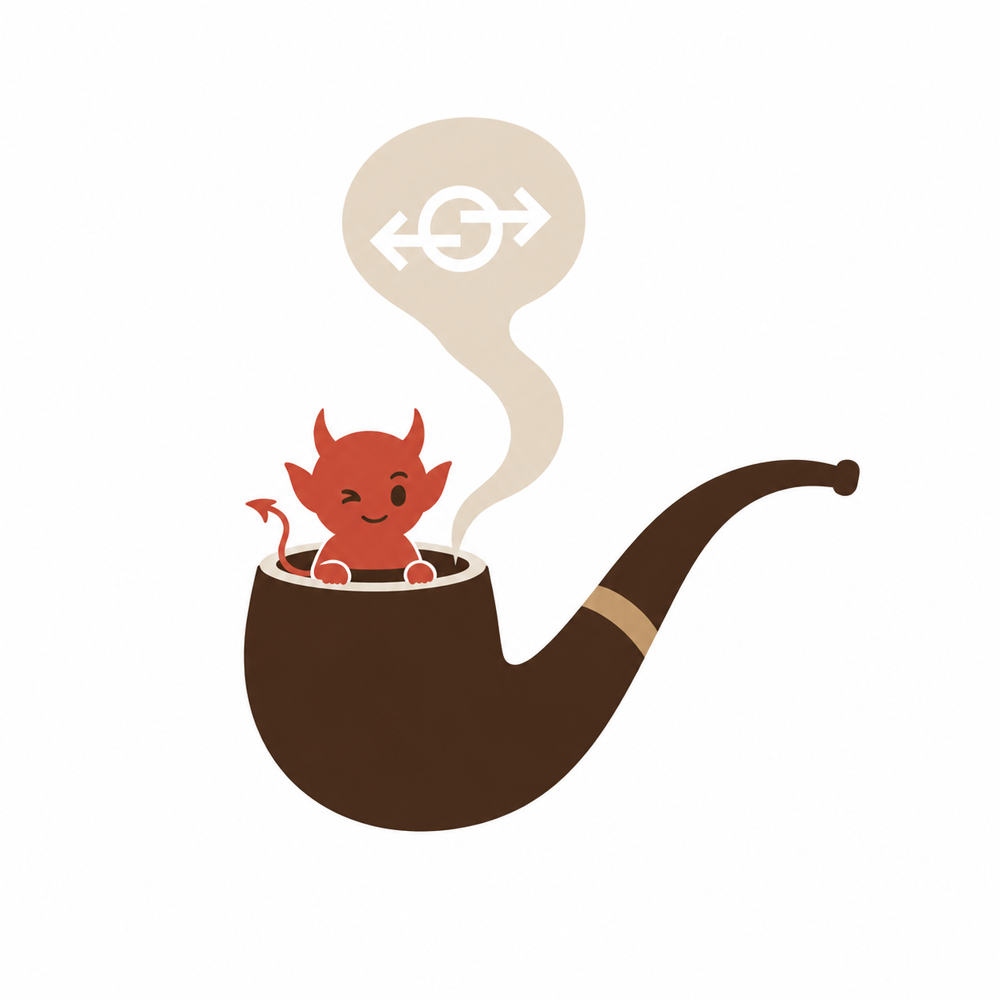

<p align="center">
  
</p>

# snulbug

`snulbug` is a local-dev MCP policy proxy. Put it between an MCP client and one
or more local MCP servers before you hand an agent a broad toolset or expose a
server through a public tunnel.

It gives you a tight loop for agent-tool safety:

- start with a conservative `tunnel-safe` policy
- watch live allow/block decisions while traffic flows
- record redacted replay and audit logs
- learn a least-privilege policy from observed traffic
- amend blocked requests into reviewable candidate bundles
- use task-scoped leases for temporary tool/path grants
- map OAuth claims to MCP tool allowlists before Lua policy runs
- pin facade upstream identity with signed manifests

The standalone ASGI Lua middleware is still available, but it is an
implementation surface. The main use case is protecting local MCP traffic.

## Install

`snulbug` is not published on PyPI yet. Use `uv` from the source tree or install
from GitHub.

From this repository:

```bash
uv sync
uv run snulbug --help
```

For contributor/dev tooling:

```bash
uv sync --all-extras --dev
uv run pytest
```

From another `uv` project:

```bash
uv add "snulbug[discovery] @ git+https://github.com/lbruhacs/snulbug"
```

Add the Redis extra when you need Redis-backed policy, runtime, or member state:

```bash
uv add "snulbug[discovery,redis] @ git+https://github.com/lbruhacs/snulbug"
```

`snulbug` supports Python 3.10 through 3.13.

## Golden Path

The primary workflow is:

```text
share create -> share run -> share status -> policy amend -> share activate -> share report
```

Ask the CLI for a copy-paste version before wiring a client or harness:

```bash
uv run snulbug mcp guide --workflow share
uv run snulbug mcp guide --workflow learn-amend-impact --compact
```

1. Create a temporary share session with generated bearer auth, a task lease,
   provider setup, client config, and close-out report commands:

```bash
uv run snulbug mcp share create \
  --provider holepunch \
  --upstream http://127.0.0.1:9000 \
  --allow-tool safe_read_file \
  --allow-tool list_project_files \
  --ttl 30m
```

2. Run the protected gateway from the generated share directory:

```bash
export SNULBUG_SHARE_TOKEN=...
uv run snulbug mcp share run .snulbug/shares/share-...
```

Inside a generated share directory, `uv run snulbug mcp share run` is enough;
it reads `.snulbug/share/session.json` and reconciles the active config,
policy, lease, and log paths before starting the gateway.

3. Check what is happening:

```bash
uv run snulbug mcp share status .snulbug/shares/share-...
```

4. If a legitimate request was blocked, amend the reviewed policy bundle from
   the audit log:

```bash
uv run snulbug mcp policy amend \
  .snulbug/shares/share-.../policy.snulbug \
  .snulbug/shares/share-.../traces/audit.jsonl \
  --out .snulbug/shares/share-.../policy.snulbug \
  --force
```

5. Promote and activate the share policy without leaving the share workflow:

```bash
export SNULBUG_BUNDLE_SECRET=...
uv run snulbug mcp share promote .snulbug/shares/share-... --to proposed --key-id local-review
uv run snulbug mcp share promote .snulbug/shares/share-... --to approved --key-id local-review
uv run snulbug mcp share activate .snulbug/shares/share-... --key-id local-review
```

6. Generate the closeout report from the session model and audit evidence:

```bash
uv run snulbug mcp share report .snulbug/shares/share-... \
  --output .snulbug/shares/share-.../share-report.md
```

Before sharing a public URL or client config, run the share doctor. It is the
single pre-share gate for generated config, policy bundle validity, fabric
checks, current status, and public tunnel safety:

```bash
PUBLIC_MCP_URL=https://YOUR-FORWARDING-DOMAIN/mcp
uv run snulbug mcp share doctor .snulbug/shares/share-... \
  --url "${PUBLIC_MCP_URL}"
uv run snulbug mcp share client .snulbug/shares/share-...
```

If the share uses OAuth protected-resource mode, run the auth doctor too:

```bash
uv run snulbug mcp share auth doctor .snulbug/shares/share-... \
  --url "${PUBLIC_MCP_URL}" \
  --token "${ACCESS_TOKEN}"
```

For multi-upstream facade setups, inspect the declared fabric before handing it
to an agent:

```bash
uv run snulbug mcp fabric status --config snulbug.toml
uv run snulbug mcp fabric doctor --config snulbug.toml --token local-dev-secret
uv run snulbug mcp fabric conformance generate \
  --config snulbug.toml \
  --log traces/session.jsonl \
  --out .snulbug/fabric-conformance
uv run snulbug mcp fabric conformance run .snulbug/fabric-conformance
```

See the full [local MCP policy gateway quickstart](docs/quickstart.md) for
client setup, facade mode, fabric checks, recording, replay, inspection, and
tunnel notes.

## Demos

Run the local policy lab when you want the full lifecycle without wiring a real
server:

```bash
uv run snulbug mcp share lab
```

The lab creates fake MCP upstreams behind one facade, records traffic, learns a
least-privilege policy, amends a blocked request into a candidate policy, and
writes replay/audit/report artifacts under `.snulbug-lab/`.

Run the OAuth auth lab when you want to prove the stronger public-share model:
valid OAuth subject, tenant/group identity fence, mapped MCP tool scope, active
task lease, Lua approval, and redacted audit output.

```bash
uv run snulbug mcp share auth lab
```

It writes a mock issuer, JWKS, demo tokens, lease file, proxy config, requests,
session/audit logs, and `AUTH_LAB.md` under `.snulbug-auth-lab/`.

For Codespaces, start the bundled mock MCP server in the Codespace terminal:

```bash
uv run snulbug mcp share codespace serve-demo
```

It prints the forwarded MCP URL and the matching laptop command. On the laptop,
attach that URL to a local snulbug gateway:

```bash
uv run snulbug mcp share codespace attach https://YOUR-CODESPACE-9001.app.github.dev/mcp
```

`attach` generates `.snulbug/codespace-local/`, preflights the upstream with
`tools/list`, starts the gateway at `http://127.0.0.1:8080/mcp`, and writes
replay/audit logs for inspection.

## Live Use

Watch decisions while proxying. The generated config includes a console event
sink by default:

```bash
uv run snulbug mcp share run --config snulbug.toml
```

Create a task-scoped lease when you want an MCP client or agent to do one
bounded job:

```bash
uv run snulbug mcp share lease create \
  --file leases.json \
  --task "Read project docs only" \
  --allow-tool safe_read_file \
  --allow-path README.md \
  --ttl 30m
```

Send the returned `x-snulbug-lease` header with MCP requests. Set
`lease_required = true` in `snulbug.toml` when every `tools/call` must carry an
active lease. OAuth-protected shares can require both a valid scoped OAuth token
and an active task lease before Lua allows the tool call.

After a session, inspect the logs:

```bash
uv run snulbug mcp evidence inspect traces/session.jsonl
uv run snulbug mcp evidence inspect traces/audit.jsonl --kind audit
```

Learn a least-privilege bundle from observed traffic:

```bash
uv run snulbug mcp policy learn traces/session.jsonl --out learned-policy.snulbug
uv run snulbug bundle validate learned-policy.snulbug
uv run snulbug bundle test learned-policy.snulbug
```

Preview the blast radius before enabling a candidate policy or lease:

```bash
uv run snulbug mcp evidence impact traces/session.jsonl \
  --policy learned-policy.snulbug/policy.lua \
  --lease leases.json \
  --report-out traces/impact-report.md
```

When the learned policy blocks a legitimate request, generate a candidate
amendment instead of editing the active policy in place:

```bash
uv run snulbug mcp policy amend \
  learned-policy.snulbug \
  traces/audit.jsonl \
  --out candidate-policy.snulbug
```

## What It Enforces

Request-side policy:

- bearer challenges and auth checks
- MCP method and tool allowlists
- JSON-RPC batch rejection
- project path constraints for tool arguments
- agent workspace firewalling with path classification and secret/generated path blocks
- schema-aware validation of `tools/call` arguments from MCP `inputSchema`
- task-scoped capability leases with expiring tool/path grants
- small stateful policies such as rate limits and idempotency keys

Response-side policy:

- redaction of likely secrets from tool/resource/prompt results
- maximum MCP response body size
- optional blocking for instruction-like tool output
- `tools/list` description and schema pinning to catch silent upstream changes
- human confirmation for risky or otherwise blocked calls, with allow-once or session approval

Workflow:

- redacted replay logs for deterministic policy testing
- audit JSONL with MCP-aware fields
- provider-aware tunnel audit fields for ngrok, Cloudflare, Tailscale, LocalXpose, Pinggy, Holepunch, and generic forwarders
- optional Cloudflare Access origin-side audit/enforcement
- optional OAuth protected-resource mode with JWT/JWKS or token-introspection validation and MCP bearer challenges
- OAuth scope-to-MCP method/tool mapping for least-privilege public shares
- OAuth resource/audience drift checks for tunnel-safe public shares
- generated auth interop recipes for Keycloak, Auth0, Okta, Entra, Cloudflare Access, and GitHub OIDC
- composable OAuth + task lease + Lua policy access decisions
- anti-passthrough credential brokering so caller OAuth tokens stop at snulbug
- learned least-privilege bundles from observed traffic
- candidate amendments for blocked legitimate requests
- a decision console for live local tunnel traffic

## Documentation

Start with:

- [Quickstart: local MCP policy gateway](docs/quickstart.md)
- [MCP share sessions](docs/mcp-share.md)
- [MCP CLI guide for agents and harnesses](docs/mcp-guide.md)
- [MCP policy workflow: preset, learn, amend, lifecycle](docs/mcp-policy.md)
- [MCP schema workflow: discover, diff, generate policy](docs/mcp-schemas.md)
- [MCP evidence workflow: record, replay, inspect, impact, diff](docs/mcp-evidence.md)
- [MCP reverse proxy](docs/mcp-proxy.md)
- [MCP fabric config, discovery, and conformance](docs/mcp-fabric.md)
- [Codespaces and devcontainers](docs/devcontainers.md)
- [MCP client setup recipes](docs/mcp-client-recipes.md)
- [MCP auth interop recipes](docs/mcp-auth-recipes.md)
- [Security model](docs/security-model.md)
- [Positioning and comparisons](docs/comparison.md)
- [Roadmap](docs/roadmap.md)

Reference docs:

- [MCP presets](docs/mcp-presets.md)
- [MCP learn and amend mode](docs/mcp-learn.md)
- [MCP evidence record, replay, and inspect](docs/mcp-recorder.md)
- [MCP evidence impact preview](docs/mcp-impact.md)
- [ASGI middleware getting started](docs/getting-started.md)
- [Lua request API](docs/lua-request-api.md)
- [Action reference](docs/actions.md)
- [State adapters](docs/state.md)
- [Policy bundles](docs/bundles.md)
- [MCP gateway example](docs/mcp-gateway.md)
- [End-to-end MCP policy proxy demo](examples/mcp_proxy_demo/README.md)
- [Release process](docs/release.md)

`snulbug` is currently alpha software. Until 1.0, action schemas and trace
fields may evolve.
